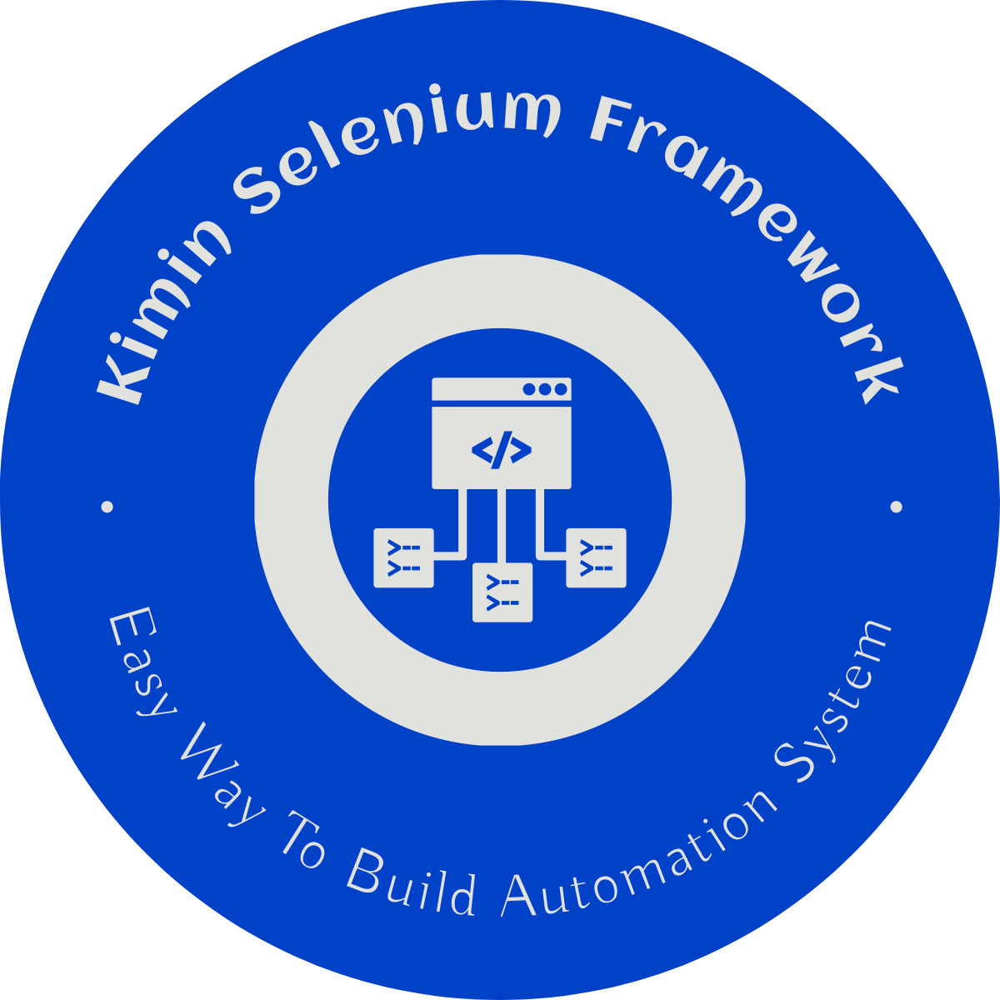

# Kimin Selenium Framework (KSF)

<p align="center">
  
</p>
     Kimin Selenium Framework adalah sebuah framework yang dirancang untuk mempermudah proses pembuatan otomatisasi web dengan menggunakan Selenium WebDriver. Framework ini memungkinkan pengguna untuk membuat skrip otomatisasi dengan mudah, hanya dengan melakukan serangkaian klik dan konfigurasi. Hasil dari framework ini adalah berupa script python yang nantinya bisa di sesuaikan ulang.

## Fitur

- [Read File](#baca-file)
- [Write File](#tulis-file)
- [Databank Sistem / Array]()
- [Add Data To Databank/Array]()
- [Looping / Statmen For]()
- [Print]()
- [Resize Browser]()
- [Close Browser]()
- [Delay / Time Sleep]()
- [Percabangan / IF Statmen]()
- [Fill Function / Isi Text Pada Elemen]()
- [Visit / Mengunjungi URL]()
- [Scroll Function / Scroll Pada Suatu Elemen]()
- [Extract Text / Mengambil Text Pada Suatu Elemen]()
- [Close Browser]()


## Penggunaan

**WINDOW**
```python
KSF.exe -p Your_Name_Project/Folder
```

**LINUX**
```bash
chmod +x ./KSF
sudo apt install python3-tk
./KSF -p Your_Name_Project/Folder
```

*NB:Klik Kiri Untuk Menambahkan Komponen dan Kanan Untuk Menghapus Komponen*


## BACA FILE

| Field |  Description                |
| :-------- | :------------------------- |
| `Path File` | Digunakan Untuk Mendefinisikan Dimana Lokasi/Path File Yang Akan Dibaca  |
| `Var/Databank` | Digunakan Untuk Menyimpan Data Yang Dibaca Pada Variabel  |


## Tulis FILE

| Field | Description                |
| :-------- | :------------------------- |
| `Path File` | Digunakan Untuk Mendefinisikan Dimana Lokasi/Path File Yang Akan Ditulis  |
| `Var/Databank`| Digunakan Untuk Memanggil Nama Variabel/Databank Yang Akan Ditulis |
| `Split By` | Karakter Apa Yang akan di Ditambahkan di Akhir Data |
